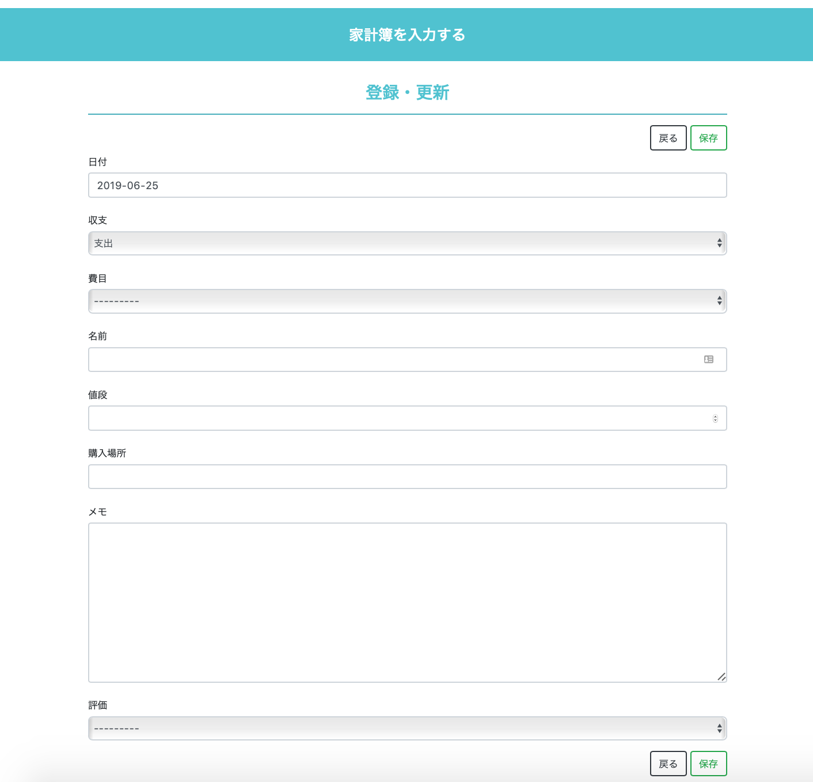
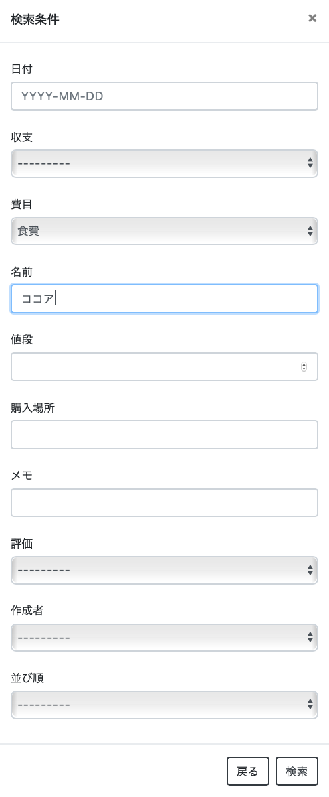

# KAKEIBO（家計簿アプリ）

## 概要
家計簿データ（日付，費目，名前，値段）などを入力・編集可能なDjangoのアプリケーションです。
また，月ごとに「毎日どれくらいお金を使っているか」，「費目ごとにどれくらいの割合でお金を使っているか」をグラフで表示したページを作成しました。

## 機能紹介

### トップページ

家計簿を入力するページです。
1ページに最新の10個のデータを表示し，それ以外のデータは次のページに表示されます。

### 前のページ，次のページ

- ページの遷移を実行します。

### 新規

- 家計簿データを新規作成します。

  

### 検索

- 入力されている家計簿データから絞り込みして表示ができます。

  

  

  

### 削除

- 入力されている家計簿データを削除できます。

  

### 月ごとにグラフで見る

- 新しいページで家計簿データを月ごとにグラフで見ることができます。

- 毎日どれくらい使っているか

  - 日毎にどれくらいお金を使っているかを見ることができます。
  - 大きな出費を出した日を把握することができます。

- 費目ごとにどれくらい使っているか

  - お金の使い方に偏りがあるかどうか確認できます。
  - どの費目にどれくらい使いたいかの目安を考えることができます。

- 月ごとにグラフを表示

  

  

  

## Requirement

Django==2.1.2
django-crispy-forms==1.7.2
django-filter==2.0.0
pytz==2018.5
pandas==0.23.4

## 参考
[okoppe8/instant-django](https://github.com/okoppe8/instant-django) をベースにプログラムを作成。
